# Hospital Length of Stay (LOS) Prediction — End-to-End ML & MLOps System

An **end-to-end, production-grade Machine Learning system** designed to predict **hospital Length of Stay (LOS)** using structured clinical data.  
The project emphasizes **real-world MLOps practices**, including reproducible pipelines, model explainability, cloud deployment, and decision-support interfaces.

Built with an **enterprise mindset** — focusing on scalability, interpretability, cost-aware deployment, and production readiness.

---

## What This Project Demonstrates

✅ Real-world healthcare ML problem (regression, skewed targets)  
✅ Advanced feature engineering & preprocessing pipelines  
✅ Hyperparameter-tuned **XGBoost regression**  
✅ **SHAP explainability** (global + local)  
✅ **Streamlit decision-support UI**  
✅ **Vertex AI model deployment** (training + endpoint inference)  
✅ Cost-safe MLOps workflows (deploy → test → undeploy)  
✅ Production-ready Git repository structure

---

## Problem Statement

Hospitals must estimate **Length of Stay (LOS)** early to:
- Optimize bed utilization
- Reduce operational costs
- Improve patient flow & care planning

This model predicts LOS (in days) using patient demographics, diagnoses, procedures, medications, and utilization history.

---

## What This Project Demonstrates:
✅ End-to-end ownership from problem framing → modeling → deployment → inference

---

## System Architecture

Raw Data → Preprocessing Pipeline → Feature Engineering (130 features)
→ XGBoost Regression (Tuned) → Evaluation (MAE / RMSE)
→ Explainability (SHAP) → Deployment (Vertex AI)
→ Streamlit UI (Inference)

---

##  Model Performance

| Metric | Value |
|------|------|
| Validation MAE | **~1.61 days** |
| Validation RMSE | **~2.23 days** |
| Features | 130 |
| Samples | 101,766 |

> Predictions are **clipped to realistic bounds (1–14 days)** to prevent unsafe outputs.

---

## Key Design Decisions

- **Model Choice (XGBoost over Deep Learning)**  
  Selected tree-based models due to structured tabular healthcare data, achieving better stability and interpretability.

- **Prediction Safety (Clipping 1–14 days)**  
  Prevented unrealistic outputs (e.g., negative LOS), ensuring safe and clinically usable predictions.

- **Production-Oriented ML Lifecycle**  
  Designed the system to simulate real-world ML pipelines including training, deployment, validation, and inference consistency across environments.

- **Explainability First Approach**  
  Integrated SHAP for both global and per-patient explanations to support trust in healthcare decision-making.

- **Cost-Aware MLOps**  
  Designed deploy → test → undeploy workflows on Vertex AI to avoid unnecessary cloud costs.

- **Reproducibility**  
  Built modular preprocessing pipelines to ensure consistent training and inference across environments.

##  Explainability (SHAP)

Global and local interpretability is implemented using **SHAP**.

###  Global Feature Importance
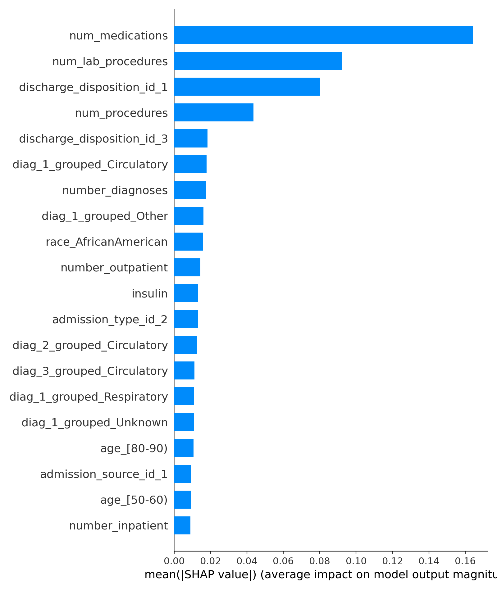

###  Feature Impact & Direction
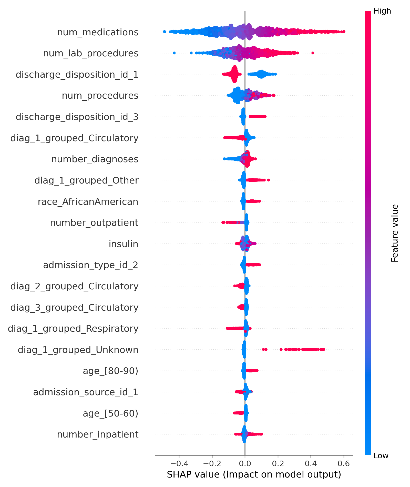

###  Individual Patient Explanation
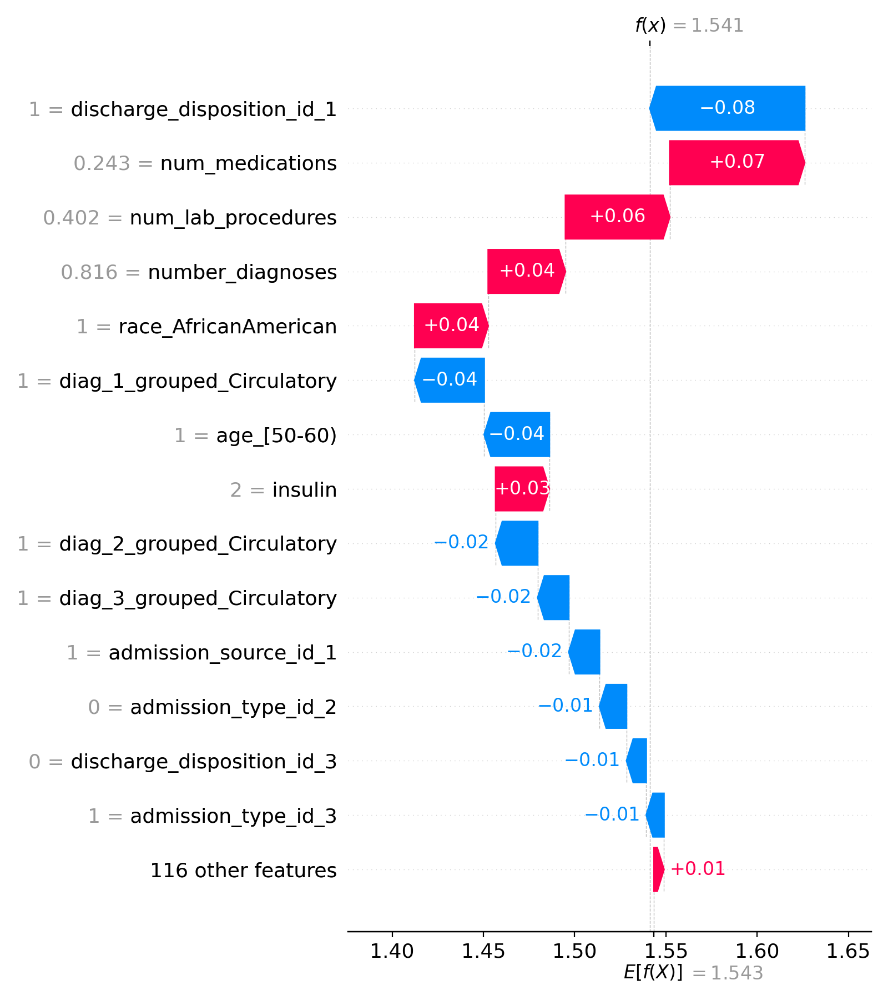

###  Feature Behavior (Dependence Plots)
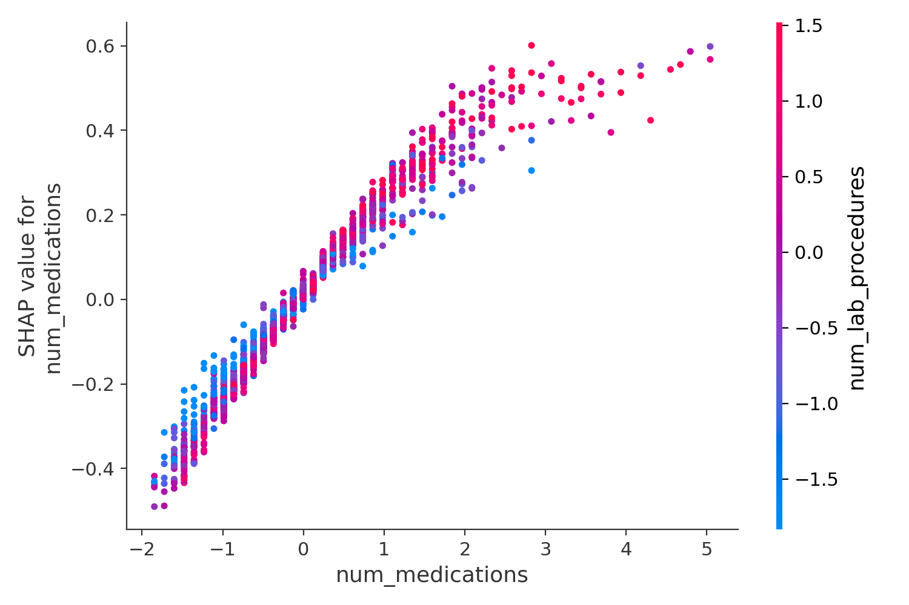

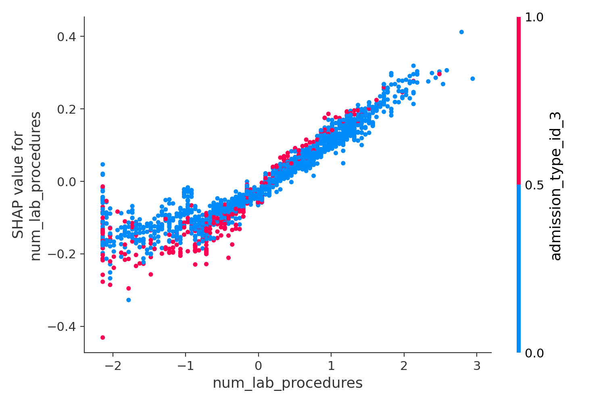

---

##  Streamlit Decision-Support App

A lightweight UI for:
- Selecting a patient record
- Viewing predicted LOS
- Comparing true vs predicted values
- Visualizing prediction distributions
- Displaying SHAP explanations

### App Home
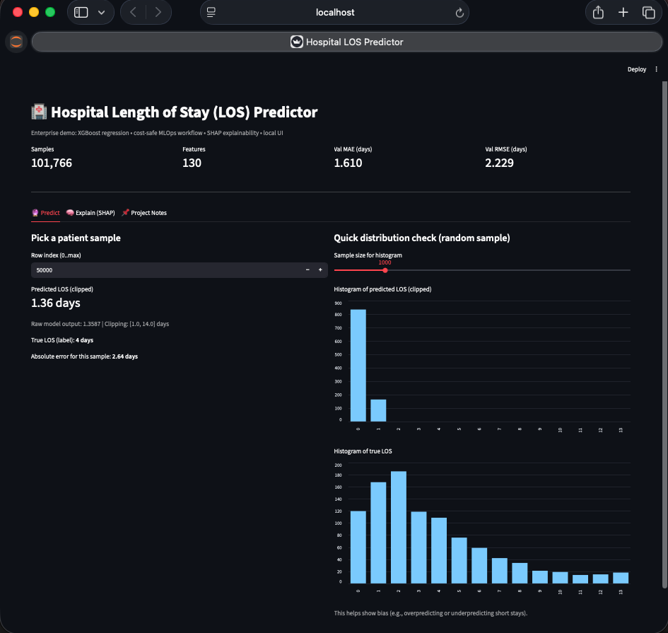

### LOS Prediction View
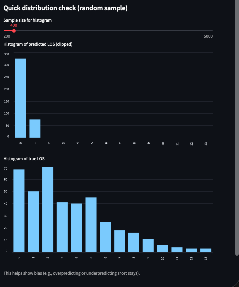

### SHAP Explainability (PDF)
[Download SHAP Explainability Report](docs/screenshots/streamlit/streamlit_shap_explainability.pdf)

```md
### Run locally:

```bash
source .venv/bin/activate
streamlit run app/streamlit_app.py

---

### Vertex AI Deployment (GCP)

- The model is deployed to Google Vertex AI for scalable inference.

Capabilities:
- Custom training jobs
- Model registry
- Endpoint deployment
- Batch inference
- Online predictions
- Cost-safe teardown

### Deployment Workflow

#### Model Uploaded
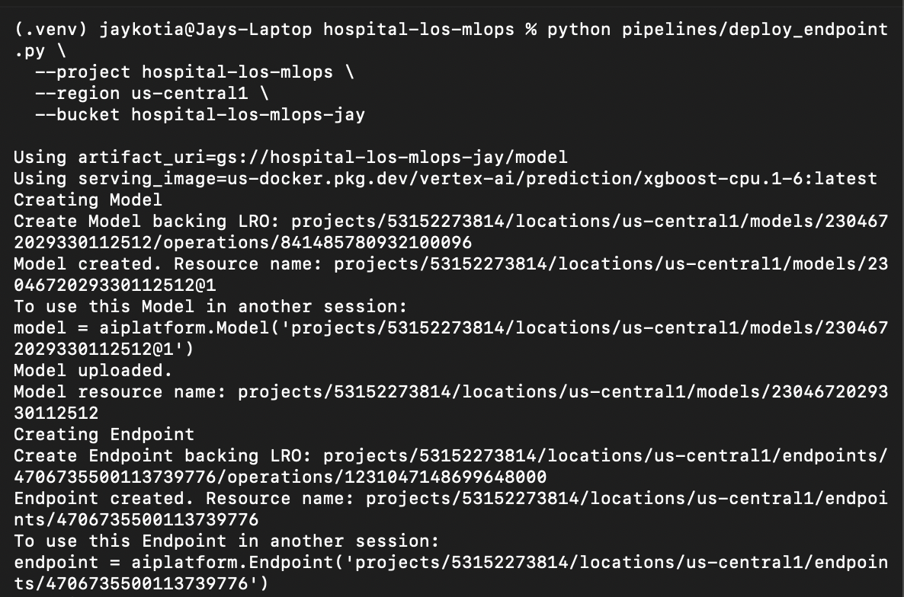

#### Endpoint Created
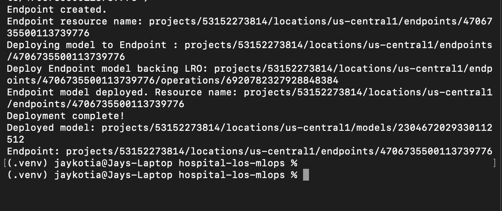

#### Endpoint Deployed
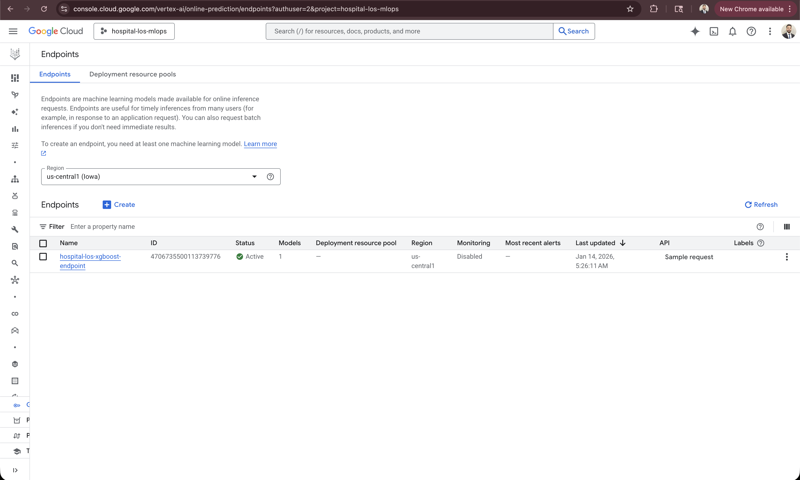

#### Online Prediction Result
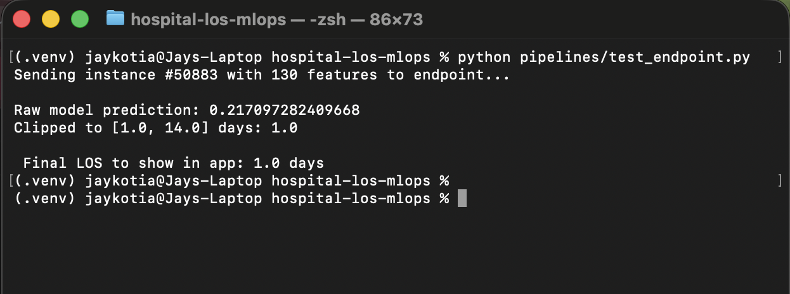

### Key scripts:

```bash
pipelines/
 ├─ launch_training_job.py
 ├─ deploy_endpoint.py
 ├─ test_endpoint.py
 ├─ test_endpoint_batch.py
 └─ undeploy_endpoint.py
Endpoints are undeployed after testing to avoid unnecessary charges.

### Repository Structure

hospital-los-mlops/
├── app/                    # Streamlit UI
├── data/                   # Raw & processed data
├── src/
│   ├── preprocessing/      # Feature engineering
│   ├── training/           # Model training
│   └── explainability/     # SHAP analysis
├── pipelines/              # Vertex AI workflows
├── reports/
│   └── figures/            # SHAP outputs
├── models/                 # Local model artifacts
└── terraform/              # (Optional infra)

---

## Tech Stack

- **Programming:** Python 3.12  
- **Machine Learning:** XGBoost, Scikit-learn  
- **Explainability:** SHAP  
- **Frontend / UI:** Streamlit  
- **Cloud / MLOps:** Google Vertex AI, Google Cloud Storage (GCS)  
- **Version Control:** Git, GitHub  

---
##  How to Run Locally

```bash
# Clone repository
git clone https://github.com/Jaykumar-Kotiya/hospital-los-mlops.git
cd hospital-los-mlops

# Setup environment
python -m venv .venv
source .venv/bin/activate
pip install -r trainer/requirements.txt

# Run preprocessing
python -m src.preprocessing.preprocess

# Train model
python src/training/train_xgboost_advanced_v2.py

# Generate SHAP explainability
python src/explainability/shap_summary.py

# Launch Streamlit app
streamlit run app/streamlit_app.py

---

## Enterprise-Grade Enhancements Included

- Feature name mapping (no opaque f0..f129)
- Prediction clipping for safety
- Reproducible preprocessing pipeline
- Batch inference evaluation
- Cost-controlled cloud deployment
- Explainability-first modeling

---

## Author

**Jaykumar Kotiya**
AI & Machine Learning Engineer
📍 Boston, MA. United States
🔗 LinkedIn: https://www.linkedin.com/in/jay-kotiya/

### 📌 Disclaimer

This project uses a public healthcare dataset for educational and demonstration purposes only.
No real patient data is exposed.
